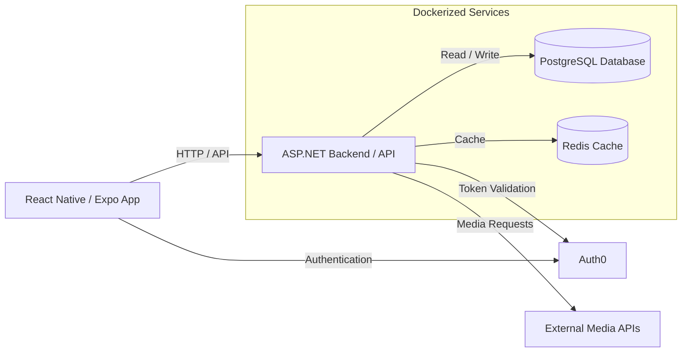

# System Architecture

This document describes the planned system architecture for **Palette**, a cross-media tracking and discovery application. It will be updated as the project evolves and architectural decisions are made.

## 1. Architecture Overview

Palette uses a client-server architecture with a React Native frontend, an ASP.NET backend, and supporting data services.

## 2. Components

### Frontend
- **React Native / Expo:** Provides the user interface for searching, tracking, reviewing, and discovering media.
- Communicates with the backend through HTTP API requests.

### Backend
- **ASP.NET:** Handles API requests, application logic, and communication with supporting services.
- Interacts with the database, cache, authentication provider, and external media APIs.

### Database
- **PostgreSQL:** Stores application data, such as user profiles, media logs, reviews, and collections.

### Caching
- **Redis:** May be used to cache frequently accessed data and reduce repeated requests.
- Its usage will depend on application needs.

### Authentication
- **Auth0:** Handles user authentication.
- The frontend uses Auth0 for login, while the backend validates authentication tokens.

### External Services
- **External Media APIs:** Provide media information such as titles, creators, genres, and other metadata.
- Specific API providers will be determined during development.

## 3. Deployment

The backend and supporting data services are planned to run in Docker containers.

The cloud hosting provider has not yet been finalized.

## 4. Future Updates

This architecture represents the current plan and may change during development. This document will be updated as new technologies, services, or architectural decisions are introduced.
