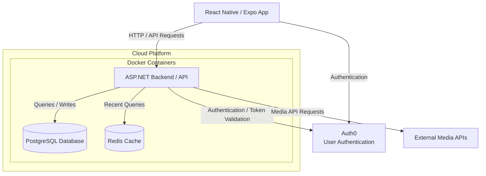

# Sprint 0

Sprint 0 establishes the initial direction for Palette, including the product vision, user context, requirements, team practices, technology choices, and preliminary architecture.

This page acts as the landing page for all Sprint 0 work.

## 1. Product Vision

People enjoy many forms of entertainment, such as movies, books, games, and music, but their activity is often spread across different platforms. This makes it difficult to keep a complete record of what they have experienced, share their opinions, and find ideas for what to explore next.  

Palette is a media tracking and discovery platform designed for three main types of users: reviewers who enjoy sharing their thoughts, viewers who are looking for recommendations, and archivers who want to keep a personal record of their media history.  

Palette brings these needs together in one place. Users can track what they watch, read, or play, post reviews, explore recommendations, and view personalized statistics. By combining these features, Palette helps users build a picture of their own media taste, or their personal “palette.” The overall vision is to create a social and personalized space where users can reflect on what they enjoy, share their interests, and discover what to experience next.

---

## 2. Target Users

Palette is designed around three main user types:

#### Reviewer
A reviewer is someone who enjoys engaging with stories and sharing their opinions about the media they consume. They may be interested in rating content, writing reviews, joining discussions, and sharing recommendations with others.

#### Viewer
A viewer is someone who is looking for ideas about what to watch, read, play, or listen to next. They may rely on reviews, recommendations, or media-specific information such as authors, series, franchises, or viewing order to help decide what to explore.

#### Archiver
An archiver is someone who wants to keep a personal record of the media they have consumed. They may use Palette as a media diary, track their activity over time, view statistics and visualizations, and share parts of their history or recommendations with others.

---

## 3. Core Features

Palette currently plans to include six core features:

- **Authentication**
  - User account creation and login
  - Secure access to personal data

- **Search & Discovery**
  - Search for movies, books, games, music, and other supported media
  - Browse and discover media through relevant categories, creators, series, or other relationships

- **Logging & Archiving**
  - Save watched, read, played, or listened-to media
  - Maintain a personal history of media activity
  - Organize saved media into collections or records

- **Recommendations**
  - Recommend what users may want to watch, read, play, or listen to next
  - Use user activity, community data, and relationships between media to support recommendations
  - Support specialized recommendations such as canonical or release-order viewing

- **Sharing & Social Features**
  - Rate and review media
  - Participate in discussions
  - Share media activity, opinions, and recommendations with other users

- **Analytics & Visualizations**
  - View statistics about personal media consumption
  - Track information such as total activity time and unique directors, authors, or game studios
  - Generate graphical summaries and visualizations similar to Spotify Wrapped or Receiptify

---

## 4. User Stories and Acceptance Criteria

Each core feature is represented by at least two user stories with acceptance criteria. Detailed user stories are maintained through the project's GitHub Issues.

- [GitHub Issues](<https://github.com/ArionKennedy/COMP4350Project/issues?q=is%3Aissue>)

---

## 5. Initial Non-Functional Expectations

The following non-functional expectations have been identified for the initial system.

### Security

- User authentication information should be stored securely.
- Users should only be able to modify and access their own private account data.

### Performance

- Common actions such as loading a profile, searching for media, and saving an entry should respond within a reasonable amount of time.

### Reliability

- Saved user activity should persist correctly between sessions.
- Failed requests should not result in corrupted or inconsistent user data.

### Accessibility

- Important application functionality should be usable without relying only on colour.
- Text and interactive elements should remain readable and usable on supported screen sizes.

### Scalability

- The backend should be structured so that additional media types and users can be supported without major architectural changes.

These expectations are preliminary and may be refined later in the project.

---

## 6. Technology Stack

The current planned technology stack is:

### Frontend

- React Native
- Expo

### Backend

- ASP.NET
- Docker

### Data

- Primary database: PostgreSQL
- Redis for caching recent queries
- Docker

### Authentication and External Services

- Auth0 for user authentication
- External Media APIs to reduce storage requirements

### Hosting

- Cloud hosting provider: TBD
- AWS is currently being considered

React Native with Expo will be used for cross-platform mobile development, while ASP.NET will provide the backend application logic and APIs. PostgreSQL will serve as the primary database, with Redis used as a local server cache for frequently accessed or recent queries. Auth0 will handle user authentication, while external media APIs will be used where appropriate to reduce storage requirements. Docker will be used to containerize the different components of the system. The final cloud hosting provider is still to be determined, with AWS currently under consideration. These technology choices may be adjusted as development progresses.

---

## 7. Preliminary Architecture

The current system is planned around a client-server architecture.

Possible external APIs may later be used to retrieve information about movies, books, games, or music.

---

## 8. Team Working Agreement

The team has established a working agreement covering areas such as:

- Goals
- Roles and Responsibilities
- Communication
- Meetings
- Work Expectations
- Conflict Resolution & Unmet Expectations
- Responsible GenAI Use 
- Accountability

See:

[Team Working Agreement](Team%20Working%20Agreement.pdf)

---

## 9. Development Process [TBD]

The team will follow shared development practices for version control, code review, work planning, and communication.

### Git Workflow

- Branching strategy
- Pull request process
- Merge expectations
- Commit practices

### Code Review

- Pull requests should be reviewed before merging.
- Reviewers should check functionality, readability, and consistency.

### Work Planning

- Features will be divided into user stories.
- Stories may be divided further into development tasks.
- Work will be tracked using GitHub Issues and/or GitHub Projects.

### Communication

- Important technical or project decisions should be documented where appropriate.
- See details on [Team Working Agreement](Team%20Working%20Agreement.pdf)
